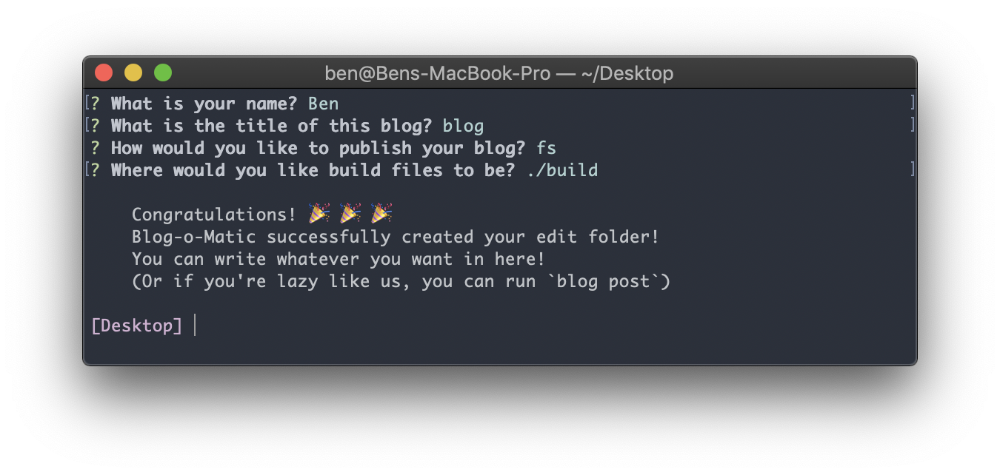

[](https://www.npmjs.com/package/blog-o-matic)


Blog-o-Matic 😳😳🤖😳
===
### Blog Content Management System for your Command-Line Interface

[Blog-o-Matic](https://github.com/ivebencrazy/blog-o-matic) connects your markdown-editing software to your chosen method of blog distribution with as little friction as possible. I made this so that I can have this process:
1. **Write a markdown blog post on my computer or on my phone**
2. **Sync edits between my devices via [iCloud](https://www.icloud.com)**
3. **Have a 1-step publish process from my computer to [my blog](https://bpev.me)**

Blog-o-Matic fills the 3rd step of that process. It takes my blog posts as source, optimizes images into multiple sizes for speed and progressive loading, parses markdown into various formats, minifies and compresses where useful, and uploads the results to S3. I currently use Blog-o-Matic to power my blog, running on [bpev.me](https://bpev.me).

Getting Started
---
You'll want to download Blog-o-Matic as a global dependency. They we can initialize a blog, where you'll be prompted by a few options:
```sh
npm install -g blog-o-matic # Installs our `blog` bin
blog init                   # Generate a blog
```



Now there are a few different commands we can use:

| Command | Description |
|---|---|
| `blog post` | Generate Markdown for a blog post |
| `blog preview` | Serve the blog, and open it as a local website |
| `blog publish` | Publish the blog, using the selected publisher |

Currently, only the basics of these commands work. As more options are added, more docs will be added.

### Publisher Guides
- [Blog-o-Matic + Github Pages](./docs/gh-pages.md)
- [Blog-o-Matic + S3](./docs/s3.md)

Development
---
We use [Yarn](https://yarnpkg.com/en/) to handle dependencies
```sh
npm install -g yarn
yarn install
yarn start
```

Blog-o-Matic should now be linked as a global npm binary
```sh
blog init
```

Blog-o-Matic is a monorepo, managed via [Lerna](https://lernajs.io/). The main `blog-o-matic` CLI tool export is essentially just an alias of: [@blog-o-matic/cli](./packages/cli). So most work is done in that cli package.

I'm mostly focusing on the cli tool at the moment, but if you want to contribute, let me know what piece of Blog-o-Matic you're interested in, and I can start making issues that are a little more organized that you can tackle.
