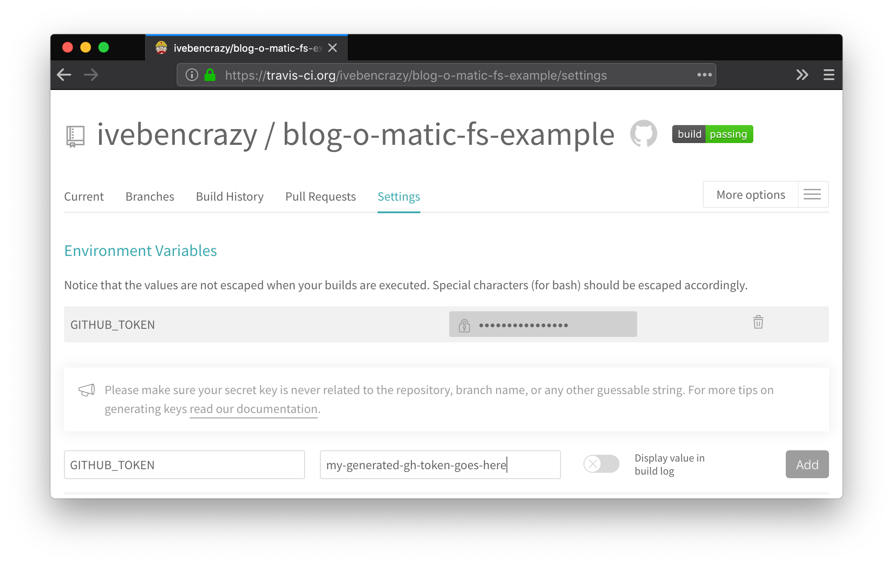
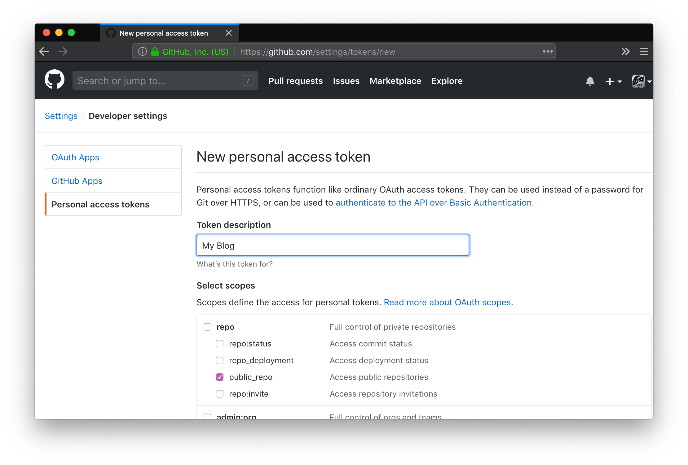
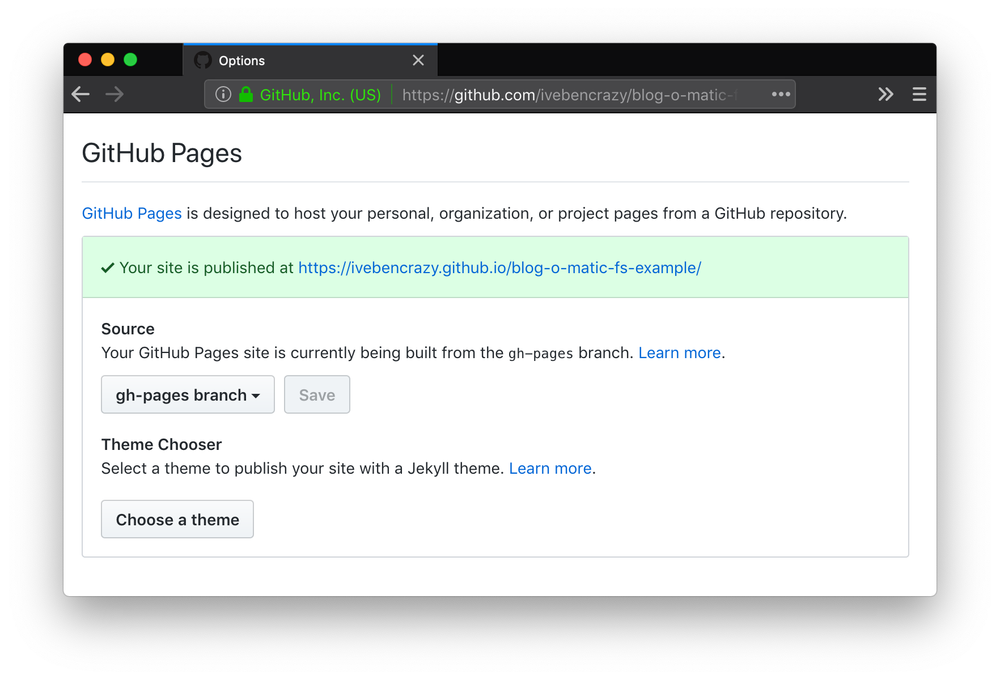

# Blog-o-Matic + Github Pages
This is a guide to setting up a static Github Pages site, built with Blog-o-Matic. An example of the resulting site is in the [fs example repo](https://github.com/ivebencrazy/blog-o-matic-fs-example), being served [here](https://ivebencrazy.github.io/blog-o-matic-fs-example/). Let's get started!

## Generate and Initialize the Blog
To generate a blog for Github pages from scratch, make sure to choose fs as the publisher! We are publishing to our local filesystem (fs), because instead of uploading our code with Blog-o-Matic, we will be uploading our code with Git! As such, we will also initialize the resulting blog as a git repo.
```sh
blog init
cd ./my-blog
git init
```


Next, we will make a .gitignore file, and add our `build` directory, so that we don't upload it to our Github source:
```sh
echo "build" > .gitignore
```

Then, we want to setup a build process that will take our source, and write it to the `gh-pages` branch of our repo. For this example, we will be using [Travis CI](https://travis-ci.org), so you'll want a `.travis.yml` file:
```yaml
language: node_js     # Blog-o-Matic is a Node CLI tool
sudo: false           # Allow us to use our global commands
node_js: [ "stable" ] # Lastest Node version should work

# Installs blog-o-matic globally, then publishes the result
script: npm install -g blog-o-matic && blog publish

deploy:
  local_dir: build            # Push the `build` dir output to gh-pages branch
  provider: pages             # We are using gh-pages
  skip_cleanup: true          # Ignore our .gitignore to keep our build output
  github_token: $GITHUB_TOKEN # We'll talk about this in a sec
  on:
    branch: master            # Build whenever we push to master branch
```

These are all the files we need! This is probably a good point to commit push to master.

Lastly, we will need to build and publish our changes with Travis CI. First, you'll want to set up your blog on [travis-ci.org](https://travis-ci.org). After this, look at your repository settings under `Environment Variables`. We want to add our `GITHUB_TOKEN` here, so that Travis CI can push to our repo's `gh-pages` branch automatically.



We will need to generate this token from Github. You'll find this in your Github Settings under `Settings > Developer settings > Personal access tokens`. Click `generate token`. You will only need to allow Travis CI to access `public_repo`:



Once we copy and paste our token, Travis should be ready, and should run when we push to master! If you go back to Github, and look at your blog repository's Settings tab, you should see something like this:



Your blog is now live! Go to the website this links to in order to see it! 🎉🎉🎉
