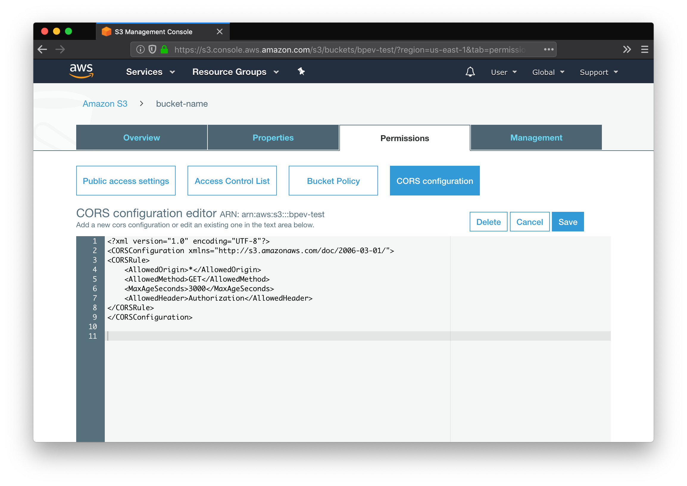
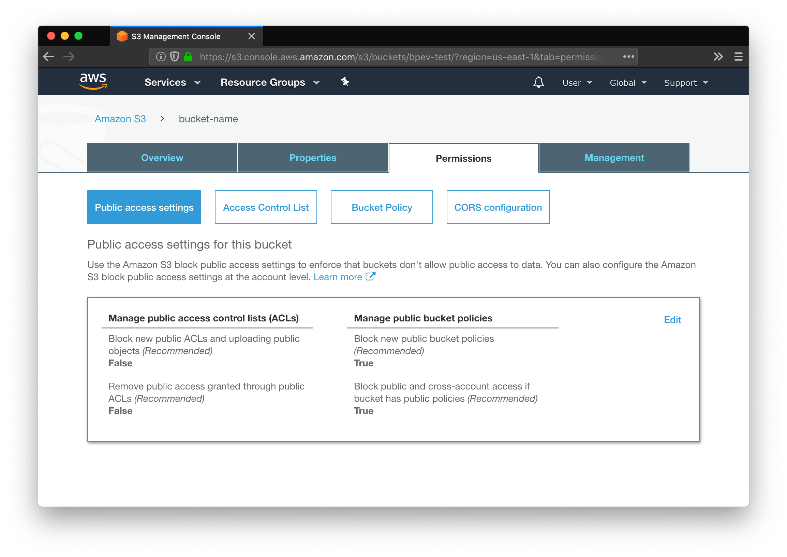
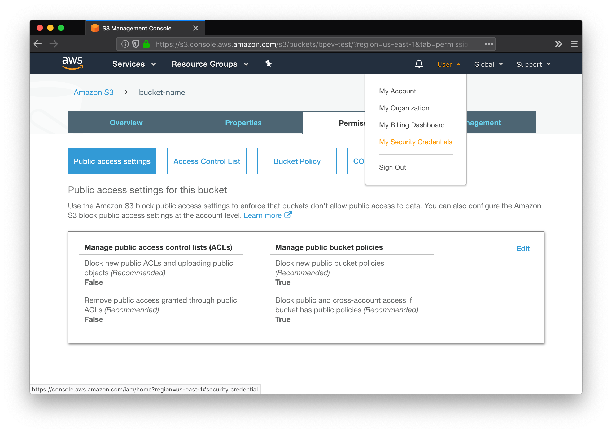
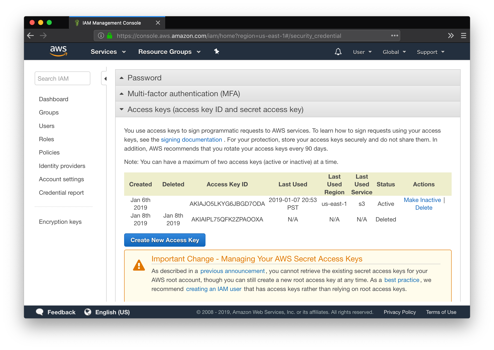

Blog-o-Matic + S3
---
This is a guide to setting up an S3 bucket to be publicly readable and accessible from a website hosted at a separate domain.

First, if we want to access our blog files from our website, we need to enable CORS on the bucket, so that we can access the files from our website hosted on another domain.

Then, we need to allow us to upload with specified Access control lists (ACL) during Blog-o-Matic's upload. This is so we can give files public read access. 

Then, we need to create an access key pair to authenticate our uploads. Created a id/secret pair in your user settings, then click `download` to download the file with the credentials csv.

Lastly, reference the csv when setting up your Blog-o-Matic blog.

You're now setup to use Blog-o-Matic with S3!!!
