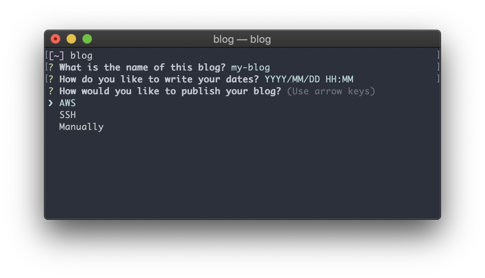

Blog-o-Matic CLI
================
The Blog-o-Matic CLI tool is for syncing your blog to your computer's filesystem


Usage
---
```sh
npm install -g @blog-o-matic/cli

cd ./my-blog
blog init # Generate a blog in current dir, save publish settings to ~/.blog-o-matic
blog post # Generate a blog post
blog edit # Serve locally as a website; preview and make edits
blog publish # Build and push blog to static server
blog backup ~/my-backup # Build and copy body the edit and build directories
```

Blog posts are checked for changes before each publish.
Blog-o-Matic automatically minimizes server uploads by looking at the names of resource files.
If you modified a resource file and want to publish it, you can force upload it in a few ways:
```sh
blog publish ./resources/my-image-1.jpg # Re-upload a file.
blog publish ./posts/my-post-1.md --force # Upload edits and all files related to a post
blog publish --force # Upload the edit folder; re-upload all files
```


How it Works
---
Blog-o-Matic uses two directories: an edit and a build directory. The edit directory is where you run `blog init`, as is meant to be human readable, using unoptimized resources. When you run `blog publish`, we create the build directory.

The build directory should be 1:1 with a static file server that is hosting your blog. Resources are optimized for various sizes, and put into related subdirectories. Blog-o-Matic will then parse the blog text content and replace the various urls with urls pointing to those optimized resources. Blog-o-Matic keeps a cache of the latest built blog in order to minimize uploads to the server


Example of `blog init`
---

